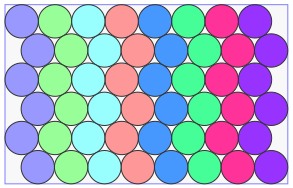
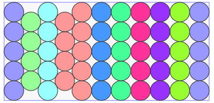
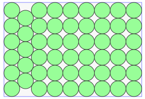

This repository contains my solutions to some Circle Packing problems.
The solutions are optimized using the [Ring2D](https://nest2d.com/ring2d/) software, they are the best that the algorithms can provide.

### Circles in circle container
#### "Magic" numbers that form complete "layers" in circle container

37 (r=6.75878) 
61 (r=8.66131) 

91 (r=10.56677) 

- 
-
-

### Circles in rectangle container
#### Packing circles with equal radius
Hexagonal lattice is not the only one when circles are packed in recangular container. Different number of circles and rectangle height result in different arrangement.

(#48  height=43000/4) 

(#53  height=40000/4) 

(#53  height=46000/4) 

(#53  height=48000/4) 

-
-

