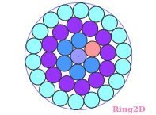
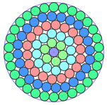

This repository contains my solutions to some Circle Packing problems.
The solutions are optimized using the [Ring2D](https://nest2d.com/ring2d/) software, they are the best that the algorithms can provide.

### Circles in circle container
#### "Magic" numbers that form complete "layers" in circle container
7 (r=3.00043) 

19 (r=4.86543) 

37 (r=6.75989) 

61 (r=8.66218) 

91 (r=10.6305) 

- 
-
-

### Circles in rectangle container
-
-
-
-

